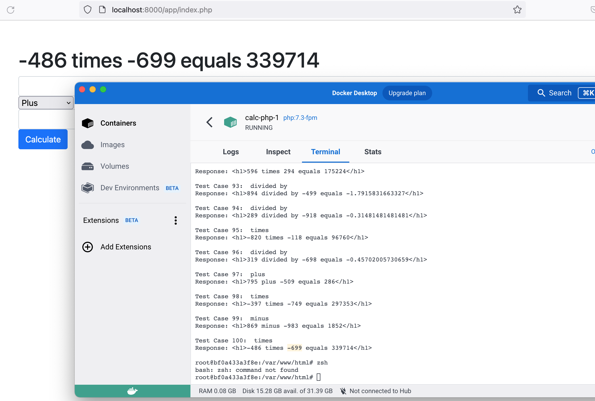

# PHP-Calculator

## Overview
PHP-Calculator is a simple yet effective PHP-based calculator that allows for unit testing and fuzz testing. This project is designed for developers who want to experiment with PHP testing methodologies, including PHPUnit, fuzz testing, and PHP_CodeSniffer for linting.

## Usage
To use the calculator, simply deploy it on your web server and visit:
```
localhost:8000/app/index.php
```
This will open the web UI for performing calculations.

## Unit Testing
### Running PHPUnit Tests
Ensure PHPUnit is installed and execute the following command:
```bash
vendor/bin/phpunit
```
If no tests are present, the output will indicate:
```
No tests executed!
```

Once test cases are added, you can run the tests using the same command:
```bash
vendor/bin/phpunit
```
For a more structured and readable output, use the `--testdox` flag:
```bash
vendor/bin/phpunit --testdox
```
This will produce output similar to:
```
PHPUnit 9.6.13 by Sebastian Bergmann and contributors.

Calculator
 ✔ Add

Time: 00:00.038, Memory: 6.00 MB

OK (1 test, 1 assertion)
```

## Fuzz Testing
Fuzz testing helps uncover unexpected edge cases. Run the fuzz test script using:
```bash
php ./fuzz_tests/fuzz_test.php
```
This can be executed via Bash or any preferred terminal.

**Example:**


## PHP_CodeSniffer for Linting
To check for coding standard violations:
```bash
vendor/bin/phpcs app/
```
To automatically fix issues (use with caution):
```bash
vendor/bin/phpcbf app/
```

Error and warning logs are stored in the `log/` folder:
1. Before fixes
2. After `phpcbf` execution
3. Final result

## Notes
- PHP 7.3 compatibility has been replaced with PHP 7.4 due to the introduction of PHP Linter by PHP_CodeSniffer.
- PHP 8.1+ compatibility has been tested.
- The `phpunit.xml` file now includes a newer `xmlns:xsi` declaration (previous version available in `phpunit.xml.bak`).

## Docker & Nginx Setup
The project now includes a Docker container setup along with an Nginx configuration for seamless deployment. This allows for easier testing and deployment across different environments.

To get started with Docker:
```bash
docker-compose up -d
```
This will start the necessary containers, including PHP and Nginx, for the application.

---

Enjoy using PHP-Calculator and happy testing! 🚀